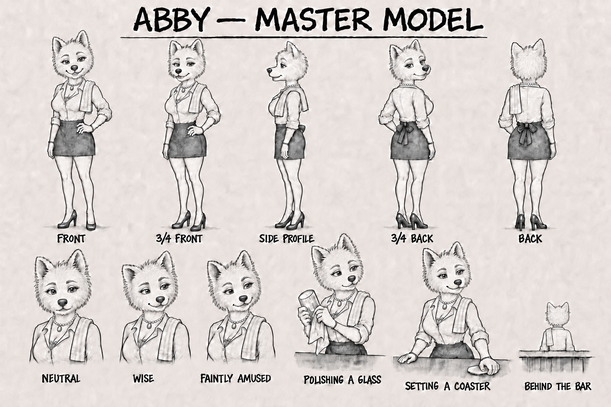

# Abby

**Canon version:** 1.0.0
**Status:** Production locked
**Role:** Owner and bartender of The Swinging Door
**Species:** Adult female anthropomorphic West Highland White Terrier

Abby is the calm intelligence at the center of the room. She owns The Swinging Door, knows every regular, catches the part of the argument everyone else missed, and can end a page of noise with one warm or dry sentence. Her attractiveness comes from confidence, wit, attentive eyes, clean shape language, and composed movement—not from helplessness or exaggerated posing.

## Canon in one paragraph

Abby is an adult female anthropomorphic Westie with a feminine hourglass silhouette, a fuller bust, a narrow waist, slim hips, smooth hairless shapely legs, a natural thigh gap, black mid-height heels, and no tail. Her face remains unmistakably canine: upright triangular ears, a short Westie muzzle, black nose, and layered white facial fur. Her eyes are expressive human-style eyes integrated into that face, with visible sclera, medium-gray irises, black pupils, catchlights, eyelids, lashes, and expressive brow-fur. Her locked work outfit is a fitted collared blouse with rolled sleeves, the top button open over a modest scalloped lace inset, a very short dark fitted bartender skirt/apron tied in a large back bow, a folded bar towel over one shoulder, a delicate bracelet, and a close-fitting pearl collar with one centered oval gemstone. She is warm, witty, intelligent, smiling, and unmistakably in charge.

## Reference sheets

| Sheet | Use it for |
| --- | --- |
| [Master model](assets/reference/abby-master-model-v1.png) | Locked identity, proportions, turnarounds, default presentation |
| [Expressions](assets/generated/abby-expression-library-v1.png) | Emotion, brows, lids, mouth shapes |
| [Eyes and face](assets/generated/abby-eyes-face-construction-v1.png) | Eye anatomy, gaze, muzzle and fur construction |
| [Hands, gestures, props](assets/generated/abby-hands-gestures-props-v1.png) | Finger anatomy, conversational gestures, bar tools |
| [Bartender actions](assets/generated/abby-bartender-actions-v1.png) | Full-body role actions and owner posture |
| [Wardrobe details](assets/generated/abby-wardrobe-details-v1.png) | Clothing, lace, jewelry, towel, bow, heels, no-tail rear |
| [Bar blocking](assets/generated/abby-bar-blocking-v1.png) | Swinging doors, counter height, back bar, room scale |

## Written references

- [`CANON.md`](CANON.md): immutable identity, allowed variation, forbidden drift.
- [`VISUAL-SPEC.md`](VISUAL-SPEC.md): construction and rendering instructions.
- [`EXPRESSIONS.md`](EXPRESSIONS.md): approved eye, brow, and mouth acting.
- [`ANATOMY-AND-GESTURE.md`](ANATOMY-AND-GESTURE.md): body, hand, prop, and pose construction.
- [`WARDROBE.md`](WARDROBE.md): locked work outfit and signature jewelry.
- [`VOICE-AND-BEHAVIOR.md`](VOICE-AND-BEHAVIOR.md): behavior and dialogue.
- [`RELATIONSHIPS.md`](RELATIONSHIPS.md): controlled interaction rules.
- [`PROMPT-PACK.md`](PROMPT-PACK.md): copy-ready generation blocks.
- [`SCENE-RULES.md`](SCENE-RULES.md): repeatable scene blueprints.
- [`QUALITY-CONTROL.md`](QUALITY-CONTROL.md): acceptance gate.
- [`CHANGE-CONTROL.md`](CHANGE-CONTROL.md): canon versioning and approvals.
- [`character.json`](character.json): machine-readable canon.
- [`prompts.json`](prompts.json): machine-readable immutable prompt blocks.

## Fast generation rule

Never prompt from memory. Attach the locked master model, attach the one specialist sheet matching the shot, paste the immutable prompt block unchanged, then add the scene request.
